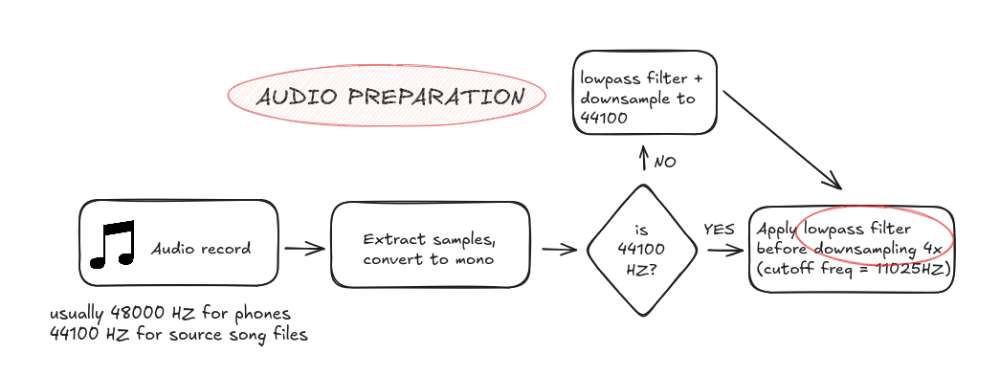
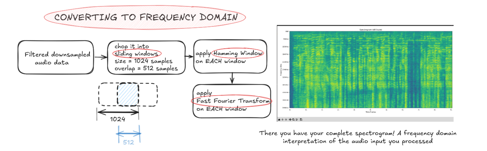
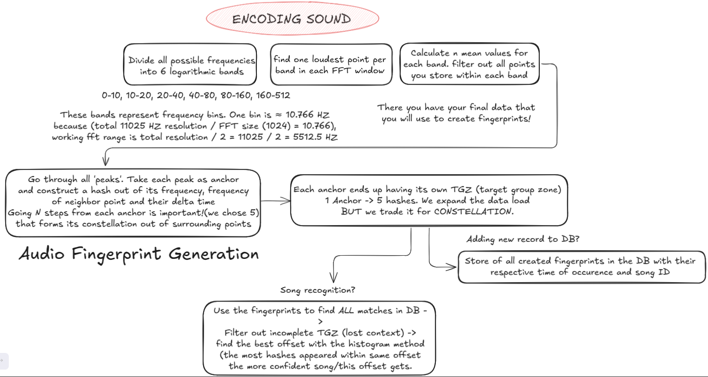

# Installing necessary packages inside WSL:

## FFT and python essentials
sudo apt update && sudo apt install -y \
build-essential cmake pkg-config \
libfftw3-dev \
python3 python3-dev python3-pip

## Python packages for plotting
python3 -m pip install --user numpy matplotlib

# Main concept and how it works:
A song recognition application. Based on audio processing and working within the frequency domain. This application is a mere attempt to re create the main idea behind Shazam, provide a FAST hash based song matching and do so also pointing out the exact piece of played song.

## Pipeline

In more detail here is how the algorithm is implemented from song up loading to the final decision of a song.
### Audio preparation

### Converting to frequency domain

### Encoding and scoring sound

### Nifty things
In the code it is possible to allow spectrogram creation to see how sound looks plotted in a frequency domain.
Also in the main root of the project after running a song recognition algorithm a sound file will appear - a reconstruction of the inputted audio after the lowpass filter and downsampling were applied!